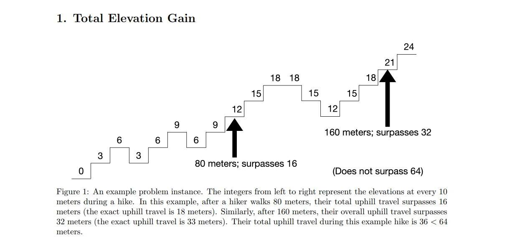
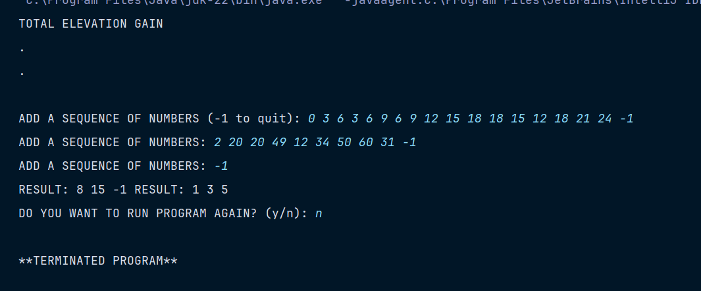
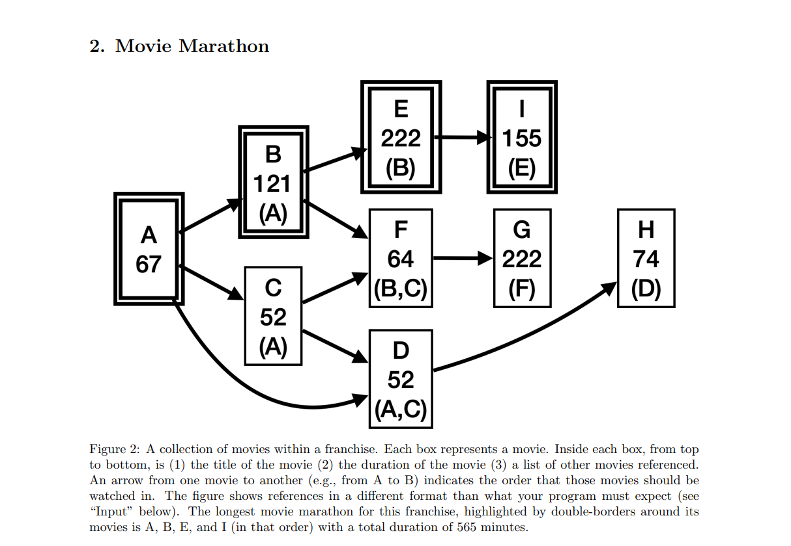
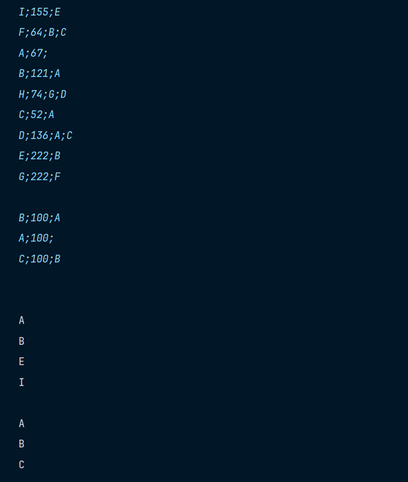

# CCSCNE 2024 Programming Competition
- Elevation Gain
- Movie Marathon
- Group Chat
- Adding Up
- Group Seating
- Run The Bases
- Three In A Row
- Square Loops

**The CCSCNE programming competition appears to emphasize a blend of theoretical computer science and practical algorithmic challenges, encouraging participants to apply diverse methods from across computer science disciplines including data structures, algorithms, graph theory, dynamic programming, and more, to solve complex, real-world problems efficiently and creatively. This makes the competition a comprehensive platform for testing and enhancing students' problem-solving skills and understanding of computer science concepts.**

## Elevation Gain:

### Visual:

### Output:

## Movie Marathon:

### Visual:

### Output:

